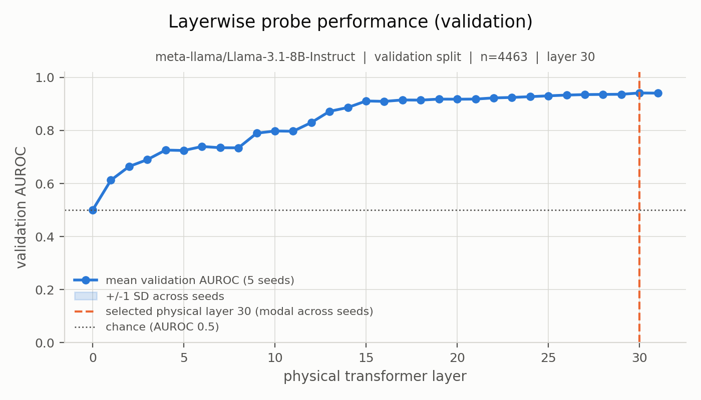
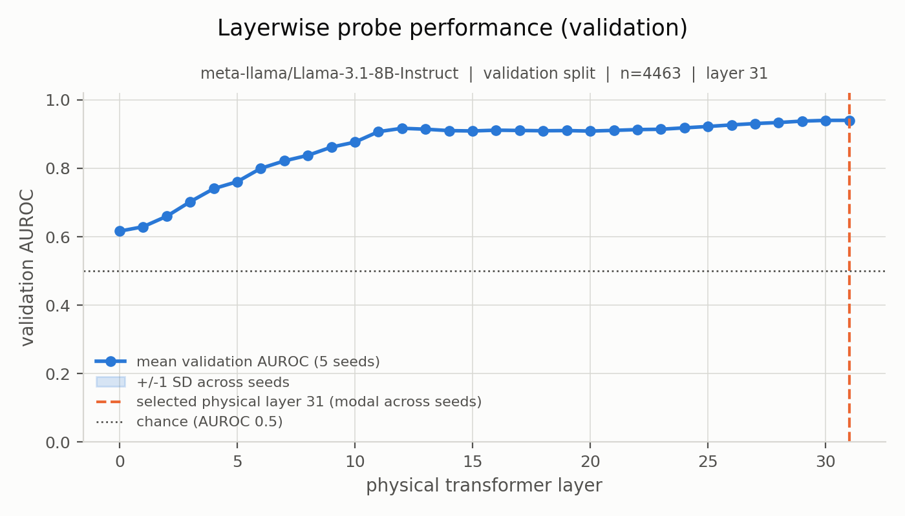
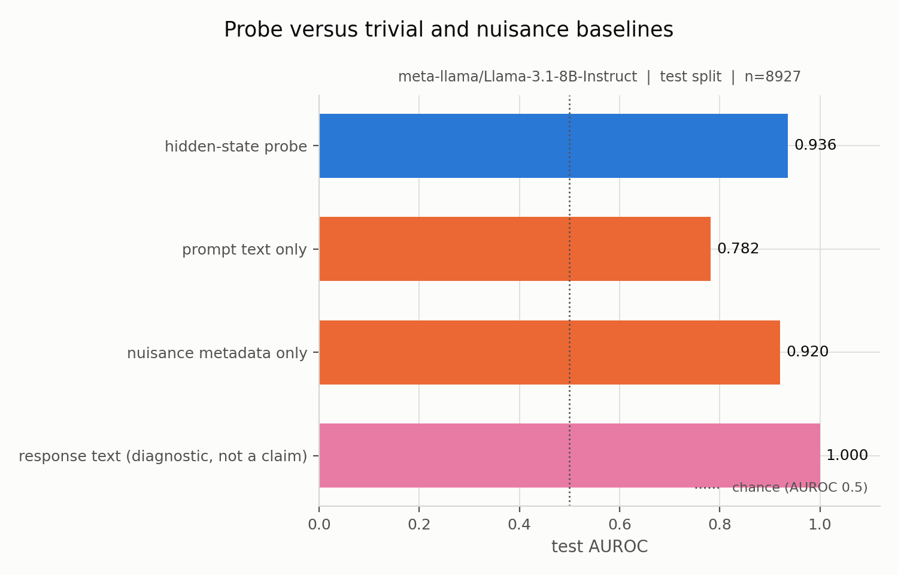
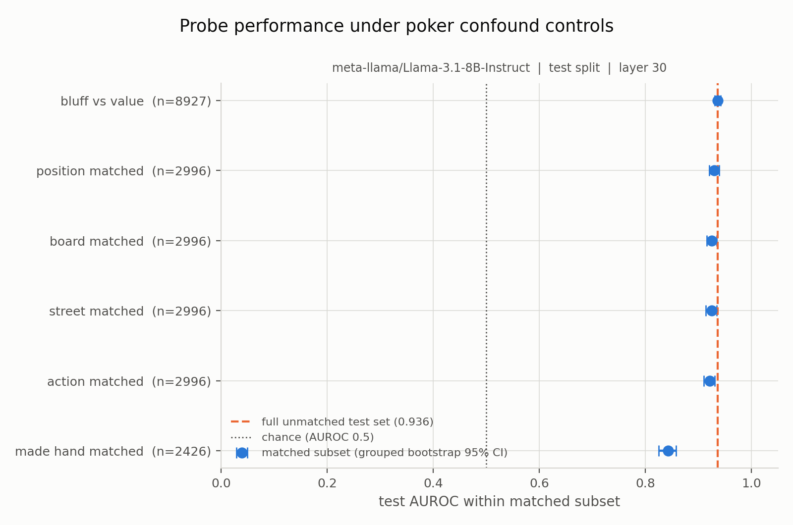
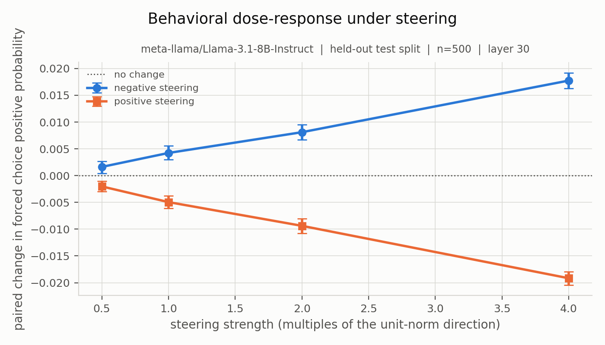
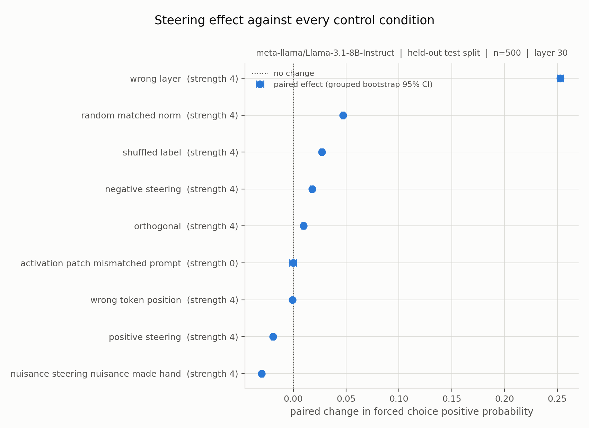
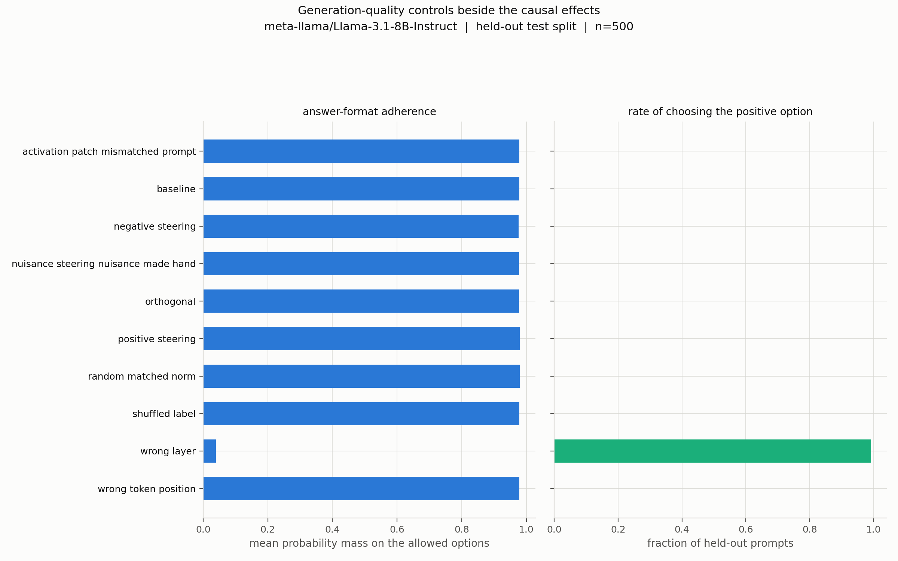
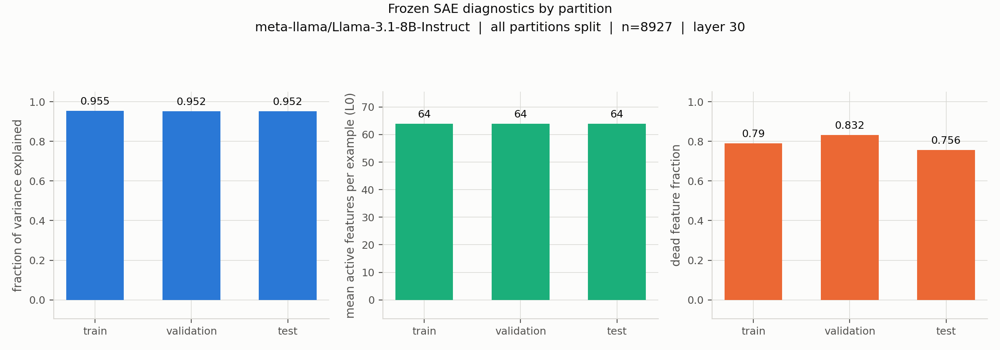
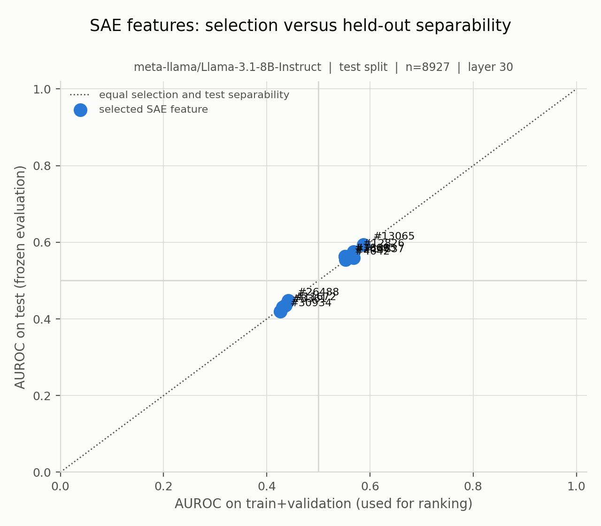

# Deception LLMs

<p align="center">
  <b>Leakage-aware mechanistic analysis of poker bluff judgements in language-model activations</b>
</p>

<p align="center">
  
  
  
  
  
</p>

This repository contains a research framework for studying what internal language-model activations reveal about an operational poker bluff label, how much of that signal is explained by ordinary task variables, and whether activation-space interventions produce specific changes in model outputs.

The final strict experiment uses **Llama-3.1-8B-Instruct**, 44,631 labelled no-limit Texas Hold'em examples, full-layer residual-stream activations, leakage-aware linear probing, nuisance controls, live-model causal interventions, and a TopK sparse autoencoder.

The central result is deliberately narrower than a "deception circuit" claim:

> **Poker bluff labels are strongly decodable from late Llama-3.1-8B activations, but much of that signal is entangled with ordinary poker-state information. Live interventions modulate the model's bluff judgement, although the tested probe direction is not uniquely specific relative to control directions.**

The canonical manuscript is:

**Poker Bluff Judgements in Llama-3.1-8B: Decodability, Confounds, and Controlled Interventions**

Source: [`paper/`](paper/)

---

## Research status

The strict real-run pipeline is complete.

| Component | Status |
|---|---|
| Dataset adaptation and validation | Complete |
| Group-safe frozen splits | Complete |
| Real activation extraction | Complete |
| Layerwise probes | Complete |
| Prompt/text/nuisance baselines | Complete |
| Poker-state confound controls | Complete |
| Learning curves and repeated seeds | Complete |
| Live-model causal interventions | Complete |
| Sparse autoencoder analysis | Complete |
| Real-artifact figure generation | Complete |
| Explicit-judgement audit | **PASS** |
| Neutral-state audit | **PASS** |
| Regression suite | **254 tests passing** |
| Canonical manuscript | Complete |
| Artifact archival | Complete |

The archived strict checkpoint is:

```text
strict-real-run-2026-09-22
```

The default branch is `main`.

---

# Headline results

## Dataset

The strict dataset contains:

- **44,631 examples**
- **7,490 bluff-labelled examples**
- **37,141 non-bluff examples**
- **16.8% positive rate**
- **44,311 statement-derived groups**
- frozen split of:
  - **31,241 train**
  - **4,463 validation**
  - **8,927 test**

The labels are GPT-4o poker judgements, not game-theoretic ground truth and not measurements of deceptive intent.

The source examples are attributable to PokerBench, although some upstream lineage cannot be reconstructed from repository history. See [`docs/POKER_DATASET_NOTES.md`](docs/POKER_DATASET_NOTES.md).

---

## 1. Bluff labels are strongly decodable from late activations

Two prompt variants were tested using the same frozen split.

| Prompt variant | Selected physical layer | Validation AUROC | Test AUROC |
|---|---:|---:|---:|
| Explicit bluff judgement | 30 | 0.9413 | **0.9360** |
| Question-stripped neutral state | 31 | 0.9402 | **0.9351** |

Removing the explicit question asking whether the action is a bluff changes held-out AUROC by less than 0.001.

This rules out one simple explanation: the headline probe performance is not dependent on the model being explicitly asked to classify bluffing.

<p align="center">
  
  
</p>

---

## 2. Poker-state variables explain a large fraction of the signal

High probe accuracy does not imply that the model contains a clean, isolated representation of bluffing.

A nuisance-only model using parsed poker-state variables reaches:

```text
AUROC = 0.9204
PR-AUC = 0.6166
```

compared with the primary hidden-state probe:

```text
AUROC = 0.9360
```

Residualizing observed nuisance information from the hidden states reduces probe performance to:

```text
AUROC = 0.7220
```

an absolute drop of approximately:

```text
0.214
```

Matching on made-hand category reduces AUROC to:

```text
0.8426
```

The hidden states also strongly encode ordinary strategic variables such as street, position, board structure, made-hand category, and amount faced.

<p align="center">
  
  
</p>

The strongest interpretation supported by these results is therefore:

> Late activations contain substantial information predictive of the operational bluff label, but much of that information overlaps with representations of ordinary poker strategy.

---

## 3. Probe-direction interventions causally modulate the model's judgement, but specificity is limited

The strict causal experiment intervenes inside the live Llama model on **500 held-out prompts**.

The endpoint is the model's own forced-choice probability distribution over:

```text
" Yes"
" No"
```

It is **not** the probe score.

The intervention uses the validation-selected layer and a training-derived probe direction across strengths:

```text
0.5, 1, 2, 4
```

The learned direction produces a signed, approximately dose-dependent change in the model's bluff judgement.

However, several controls also produce substantial effects, including:

- matched-norm random directions
- orthogonal directions
- shuffled-label directions
- made-hand nuisance directions
- wrong-layer interventions
- wrong-token-position interventions
- mismatched-prompt activation patching

At the strongest tested intervention, some random, shuffled-label, and nuisance controls are comparable to or larger than the probe-direction effect.

The supported conclusion is therefore:

> **Causal modulation is demonstrated, but target-direction specificity is not.**

<p align="center">
  
  
</p>

Output-quality controls are evaluated alongside endpoint movement so that generic model degradation is not mistaken for targeted causal control.

<p align="center">
  
</p>

---

## 4. The sparse autoencoder reconstructs well, but individual features are unstable

The strict SAE is an unsupervised TopK dictionary trained at the validation-selected explicit-judgement layer.

Configuration:

```text
Input dimension:       4,096
Number of features:   32,768
Expansion factor:          8x
TopK:                      64
Training epochs:           60
```

Held-out diagnostics:

| Metric | Result |
|---|---:|
| Test variance explained | **0.9517** |
| Mean L0 | **64** |
| Dead-feature fraction | **0.7558** |
| Mean cross-seed max cosine similarity | **0.1009** |
| Selected single-feature test AUROCs | approximately **0.42 to 0.59** |

The SAE reconstructs the selected activation space well, but most features are dead on the held-out partition, dictionary stability across seeds is low, and individually selected features are only modest bluff-label predictors.

Therefore this repository does **not** claim to have discovered stable, monosemantic "deception features."

<p align="center">
  
  
</p>

---

# What this project does and does not show

## Supported by the strict real-run evidence

The completed experiments support the following statements:

1. The operational poker bluff label is strongly linearly decodable from late Llama-3.1-8B hidden states.
2. Removing the explicit bluff-classification question leaves raw probe performance almost unchanged.
3. Ordinary poker-state variables explain a large fraction of the apparent label signal.
4. Live-model activation interventions can causally modify the model's forced-choice bluff judgement.
5. The tested probe direction is not uniquely specific relative to the full control suite.
6. A TopK sparse dictionary reconstructs the activation space well, but individual features are weak and unstable bluff-label predictors.

## Not established by this repository

The strict experiments do **not** establish:

- deceptive intent inside the subject model
- deceptive behavior by the subject model
- a universal "deception circuit"
- a uniquely identified bluff direction
- stable monosemantic deception features
- causal control over the model's own decision to bluff
- cross-context generalization
- cross-architecture generalization under the final strict protocol
- game-theoretic ground-truth bluff labels

The subject model is judging an observed poker action that has already occurred. It is not deciding whether to bluff.

---

# Experimental pipeline

The strict paper workflow is intentionally separated from the repository's older experimental framework.

```text
Poker source data
      |
      v
poker_adapter.py
      |
      +--> judge_question dataset
      |
      +--> neutral_state dataset
      |
      v
strict dataset validation
      |
      v
group-safe + label-stratified frozen split
      |
      v
real Llama activation extraction
      |
      v
[layerwise probes] ---> [baselines]
      |                      |
      +----------+-----------+
                 |
                 v
          confound controls
                 |
        +--------+--------+
        |                 |
        v                 v
      SAE         live interventions
        |                 |
        +--------+--------+
                 |
                 v
         real-artifact figures
                 |
                 v
             strict audit
```

The authoritative implementation is under the `deception_circuits.paper*` modules.

---

# Strict pipeline architecture

The most important modules are:

```text
deception_circuits/
├── paper.py                 # strict dataset, split, probe, metrics, provenance
├── paper_cli.py             # deception-paper command line interface
├── paper_extraction.py      # real transformer activation extraction
├── paper_confounds.py       # nuisance baselines, matching, residualization
├── paper_causal.py          # live-model interventions and causal controls
├── paper_sae.py             # strict unsupervised TopK SAE
├── paper_transfer.py        # leakage-safe cross-context transfer protocol
├── paper_figures.py         # artifact-backed publication figures
├── paper_controls.py        # control-analysis helpers
├── paper_full_pipeline.py   # pipeline orchestration
└── poker_adapter.py         # normalized poker dataset adapter
```

The repository also retains earlier research infrastructure for dataset integrations, activation patching, reasoning traces, legacy sparse autoencoders, training pipelines, visualization, and broader experimentation.

Those modules are useful historical and experimental code, but **the strict paper path above is the authoritative path for the final reported evidence**.

---

# Integrity guarantees

The strict workflow was designed around common failure modes in activation-level research.

## No synthetic activation fallback

Research commands fail if required real activations are absent.

Missing activation data is never silently replaced with random tensors.

## Pre-response extraction

The primary activation path never receives the response label token.

For each sample, extraction metadata records information including:

- rendered prompt hash
- token index
- physical transformer layer mapping
- activation shape
- tensor artifact hash
- model revision
- tokenizer revision

Each completed real activation sample has shape:

```text
[32, 4096]
```

for all 32 Llama-3.1-8B transformer blocks.

## Validation-only selection

The test set is not used to select:

- probe layer
- SAE layer
- feature ranking
- intervention direction
- probe hyperparameters

## Frozen split provenance

Dataset and split checksums are recorded and verified by downstream stages.

Stale or mismatched artifacts are rejected.

## Group-safe splitting

The strict pipeline prevents the same statement-derived group from crossing train, validation, and test partitions.

These groups should **not** be interpreted as verified independent dealt poker hands or sessions.

## Missing controls remain missing

When required metadata is unavailable, the analysis is recorded as:

```text
not_run
```

with a reason.

For example, true equity matching and reliable pot-size matching are not approximated using unsupported quantities.

## Real-artifact-only figures

Publication figure builders consume result artifacts rather than hard-coded values.

Each figure is accompanied by:

- source CSV data
- provenance information
- source-artifact checksum
- `figures_manifest.json`

---

# Installation

The project uses Python 3.10.13 or newer and is configured for [`uv`](https://github.com/astral-sh/uv).

```bash
git clone https://github.com/krishjainm/deception-llms.git
cd deception-llms

uv sync
```

Verify the installation:

```bash
uv run pytest -q
```

At the archived strict checkpoint:

```text
254 passed
```

Explore the strict CLI:

```bash
uv run deception-paper --help
```

---

# Reproducing the poker datasets

The historical normalized source CSV is retained on the `dataset-integration` branch rather than the final `main` working tree.

Restore it with:

```bash
git checkout origin/dataset-integration -- sample_data/normalized_poker_gpt4o.fixed.csv
```

Generate the explicit judgement dataset:

```bash
uv run python prepare_poker_dataset.py \
  --prompt-variant judge_question
```

Generate the neutral-state dataset:

```bash
uv run python prepare_poker_dataset.py \
  --prompt-variant neutral_state
```

Outputs are written under:

```text
data/derived/
```

and include both the canonical CSV and a dataset-card JSON file.

Before interpreting the dataset, read:

[`docs/POKER_DATASET_NOTES.md`](docs/POKER_DATASET_NOTES.md)

---

# Running the strict experiment

Two finalized real-run configurations are included:

```text
configs/real_llama31_8b_judge_question.yaml
configs/real_llama31_8b_neutral_state.yaml
```

The subject model is:

```text
meta-llama/Llama-3.1-8B-Instruct
```

Pinned model and tokenizer revision:

```text
0e9e39f249a16976918f6564b8830bc894c89659
```

Activation extraction over the complete dataset is GPU-intensive.

The completed runs used:

- 44,631 forward passes per prompt variant
- all 32 transformer layers
- 4,096-dimensional residual-stream states
- bfloat16 model weights
- float32 stored activations

See [`docs/GPU_RUNBOOK.md`](docs/GPU_RUNBOOK.md) before starting a real extraction.

---

## Explicit judgement run

Set:

```bash
CONFIG=configs/real_llama31_8b_judge_question.yaml
```

Validate the dataset:

```bash
uv run deception-paper validate-data --config $CONFIG
```

Create the frozen split:

```bash
uv run deception-paper make-splits --config $CONFIG
```

Run non-model baselines:

```bash
uv run deception-paper run-baselines --config $CONFIG
```

Extract real model activations:

```bash
uv run deception-paper collect-activations \
  --config $CONFIG \
  --device cuda \
  --confirm-model-load
```

Train strict probes:

```bash
uv run deception-paper train-probes --config $CONFIG
```

Run confound analyses:

```bash
uv run deception-paper analyze-confounds --config $CONFIG
```

Train the strict SAE:

```bash
uv run deception-paper train-sae \
  --config $CONFIG \
  --device cuda
```

Run live-model interventions:

```bash
uv run deception-paper run-interventions \
  --config $CONFIG \
  --device cuda \
  --confirm-model-load
```

Generate figures:

```bash
uv run deception-paper make-figures --config $CONFIG
```

Audit the complete run:

```bash
uv run deception-paper audit --config $CONFIG
```

Expected final audit status:

```text
PASS
```

---

## Neutral-state run

Set:

```bash
CONFIG=configs/real_llama31_8b_neutral_state.yaml
```

Then run:

```bash
uv run deception-paper validate-data --config $CONFIG
uv run deception-paper make-splits --config $CONFIG
uv run deception-paper run-baselines --config $CONFIG

uv run deception-paper collect-activations \
  --config $CONFIG \
  --device cuda \
  --confirm-model-load

uv run deception-paper train-probes --config $CONFIG
uv run deception-paper analyze-confounds --config $CONFIG
uv run deception-paper make-figures --config $CONFIG
uv run deception-paper audit --config $CONFIG
```

The neutral condition deliberately does **not** run an SAE or causal intervention suite.

Its purpose is narrowly defined:

> Does bluff-label decodability survive when the prompt no longer explicitly asks whether the action is a bluff?

Expected final audit status:

```text
PASS
```

---

# Artifact layout

A completed strict run produces artifacts similar to:

```text
results/
└── poker_bluff_judge_question_llama31_8b/
    ├── baseline_results.json
    ├── probe_results.json
    ├── confound_results.json
    ├── causal_results.json
    ├── intervention_records.csv
    ├── sae_results.json
    ├── sae_feature_ranking.csv
    ├── sae_feature_examples.json
    ├── sae_model.pt
    ├── split_manifest.json
    ├── resolved_config.yaml
    ├── run_metadata.json
    └── figures/
        ├── figures_manifest.json
        ├── layerwise_probe.png
        ├── learning_curve.png
        ├── nuisance_baselines.png
        ├── confound_subsets.png
        ├── dose_response.png
        ├── intervention_controls.png
        ├── intervention_quality.png
        ├── sae_diagnostics.png
        └── sae_features.png
```

Large activation tensors and generated result directories are intentionally not stored directly in Git.

The completed real activation directories were approximately 22 GB per prompt variant.

Publication-ready figure snapshots and their source CSVs are tracked under:

```text
paper/figures/
```

---

# Dataset provenance and limitations

The strict poker dataset was reconstructed from historical project artifacts.

What is recoverable:

- PokerBench attribution
- normalized poker examples
- the historical GPT-4o poker-analysis labelling procedure
- the recovered bluff/non-bluff judgement prompt
- the final adapted 44,631-row dataset
- parsed poker metadata
- statement-derived grouping
- integrity reports

What is not fully recoverable:

- exact upstream PokerBench revision
- exact original split
- original hand/session identifiers
- final 44,631-row historical selection script
- upstream action-generation procedure
- exact served GPT-4o model snapshot

These limitations are part of the scientific interpretation, not hidden implementation details.

See:

[`docs/POKER_DATASET_NOTES.md`](docs/POKER_DATASET_NOTES.md)

---

# Cross-context transfer

The repository includes a strict transfer implementation in:

```text
deception_circuits/paper_transfer.py
```

The protocol:

1. fits probes using source-context training rows
2. chooses the layer using source-context validation rows only
3. freezes the probe and selected layer
4. evaluates on target-context rows from the held-out test partition

Regression tests explicitly verify that changing target-test labels cannot change source layer selection.

However, the final strict experiment contains only one real context.

Therefore:

> **No real cross-context generalization result is claimed.**

The transfer implementation is available for future experiments once at least two independently supported real contexts exist.

---

# Tests

The strict research path has dedicated regression coverage for:

```text
tests/
├── test_extraction_integrity.py
├── test_splits_and_curves.py
├── test_confound_controls.py
├── test_causal_suite.py
├── test_sae.py
├── test_figures.py
├── test_transfer.py
├── test_paper_integrity.py
└── test_poker_adapter.py
```

Run the complete suite:

```bash
uv run pytest -q
```

Archived strict checkpoint:

```text
254 passed
```

The tests cover issues including:

- response-token leakage
- malformed activations
- stale artifact provenance
- dataset checksum mismatches
- group leakage
- validation/test contamination
- physical-layer mapping
- intervention endpoint independence
- missing causal controls
- SAE train/test leakage
- figure provenance
- target-test leakage in transfer
- unsupported or missing analyses

---

# Documentation

The repository contains detailed documentation for both methodology and research integrity.

| Document | Purpose |
|---|---|
| [`docs/EXPERIMENT_PROTOCOL.md`](docs/EXPERIMENT_PROTOCOL.md) | strict experimental protocol |
| [`docs/GPU_RUNBOOK.md`](docs/GPU_RUNBOOK.md) | real-model GPU execution |
| [`docs/REPRODUCIBILITY.md`](docs/REPRODUCIBILITY.md) | reproducibility requirements |
| [`docs/POKER_DATASET_NOTES.md`](docs/POKER_DATASET_NOTES.md) | poker dataset provenance and limitations |
| [`docs/PAPER_CLAIM_GUARDRAILS.md`](docs/PAPER_CLAIM_GUARDRAILS.md) | evidence-to-claim boundaries |
| [`docs/SAE_AUDIT.md`](docs/SAE_AUDIT.md) | legacy vs strict SAE audit |
| [`docs/REVIEW_RESPONSE_MATRIX.md`](docs/REVIEW_RESPONSE_MATRIX.md) | reviewer concern resolution |
| [`docs/ACCEPTANCE_CHECKLIST.md`](docs/ACCEPTANCE_CHECKLIST.md) | final research acceptance checklist |
| [`docs/DATASET_REQUIREMENTS.md`](docs/DATASET_REQUIREMENTS.md) | canonical dataset requirements |
| [`docs/COMPUTE_PLAN.md`](docs/COMPUTE_PLAN.md) | compute planning |
| [`docs/P1_EXTRACTION_PLAN.md`](docs/P1_EXTRACTION_PLAN.md) | activation extraction design |

---

# Manuscript

The canonical format-neutral manuscript source is stored under:

```text
paper/
├── main.tex
├── manuscript_body.tex
├── references.bib
└── figures/
```

Compile with a standard TeX Live installation:

```bash
cd paper

pdflatex -interaction=nonstopmode -halt-on-error main.tex
bibtex main
pdflatex -interaction=nonstopmode -halt-on-error main.tex
pdflatex -interaction=nonstopmode -halt-on-error main.tex
```

Conference-specific formatting is intentionally deferred.

The scientific manuscript body and figures are designed to be moved into the template required by the eventual submission venue.

---

# Legacy and experimental framework

This repository predates the strict paper workflow and contains a larger experimental framework including:

- generic linear probing
- activation patching
- steering-vector experiments
- dataset integrations
- reasoning-trace utilities
- game data loaders
- visualization tools
- model integrations
- earlier sparse-autoencoder implementations
- production and monitoring utilities

These files remain useful for exploration and historical reproducibility.

They should not automatically be treated as part of the evidence reported in the canonical paper.

For paper claims, use the strict path:

```text
paper.py
paper_extraction.py
paper_confounds.py
paper_causal.py
paper_sae.py
paper_transfer.py
paper_figures.py
paper_cli.py
```

---

# Reproducibility checkpoint

The final strict research checkpoint is tagged:

```text
strict-real-run-2026-09-22
```

To inspect that exact repository state:

```bash
git checkout strict-real-run-2026-09-22
```

The tag corresponds to the finalized code, manuscript, figure snapshots, strict audits, and reviewer-response documentation.

Large activation tensors and the trained SAE checkpoint are archived separately from Git because of their size.

---

# Research principles behind this repository

This project was rebuilt around several principles that are easy to violate in mechanistic-interpretability experiments:

### Decodability is not specificity

A linear probe can reveal that information is accessible without identifying why it is accessible.

### Correlation is not mechanism

High AUROC does not establish that a direction causally controls a concept.

### Causal change is not causal specificity

An intervention can change an output while many unrelated directions do the same thing.

### Reconstruction is not interpretability

An SAE can reconstruct activations well without producing stable or semantically meaningful individual features.

### Missing evidence should remain missing

Unsupported analyses are marked `not_run` rather than approximated or silently omitted.

### Test data should remain held out

Layer selection, feature selection, direction learning, and hyperparameter choices occur before final test evaluation.

---

# Future work

The most informative next experiments would be:

- independently adjudicated bluff labels
- verified poker hand/session identities
- true hand-equity controls
- reliable pot-size reconstruction
- multiple independent strategic contexts
- additional subject-model architectures under the same strict protocol
- model-as-actor poker tasks where the subject model chooses whether to bluff
- feature-level SAE causal interventions
- stronger direction-specificity tests
- cross-context transfer with at least two real contexts

These experiments would help distinguish strategic-state representation, bluff judgement, and actual deceptive decision-making more cleanly.

---

# Citation

The canonical research manuscript is:

> **Poker Bluff Judgements in Llama-3.1-8B: Decodability, Confounds, and Controlled Interventions**

A venue-specific citation can be added once the manuscript has a final publication record.

For exact computational reproducibility, reference the repository checkpoint:

```text
strict-real-run-2026-09-22
```

---

# License

This repository does not currently include a `LICENSE` file.

Add an explicit license before assuming permissions for redistribution or reuse.